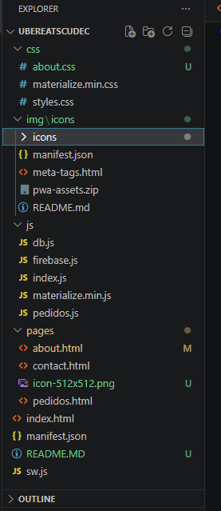
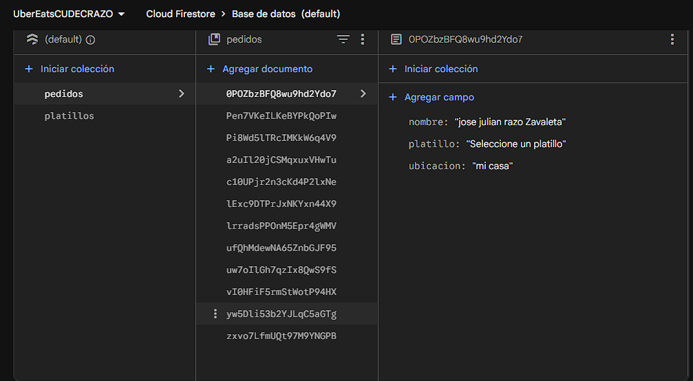
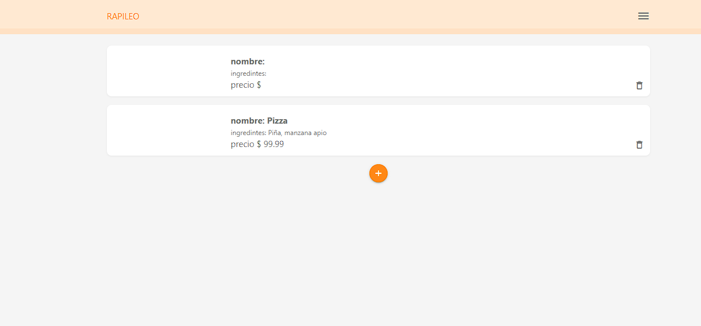
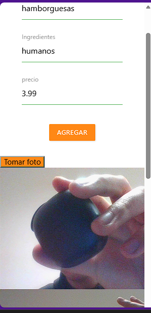
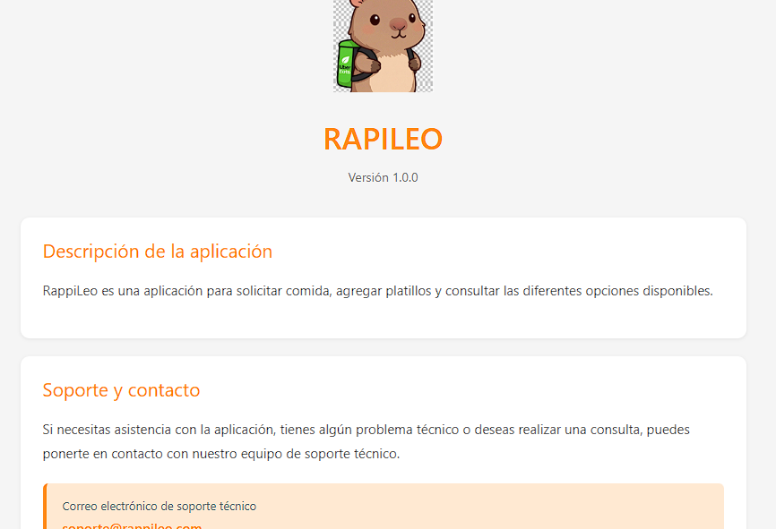
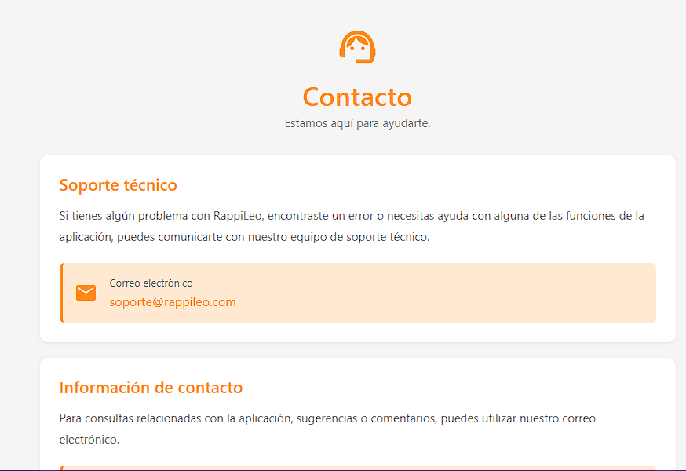

CONTENIDO DEL ARCHIVO README.MD

1. Título del proyecto: UberEats

Rappi Leo

Tipo de aplicación: PWA

RappiLeo es una aplicación para gestionar y consultar platillos de comida de forma sencilla y rápida.
Permite agregar platillos, visualizar su información y administrar pedidos desde una interfaz intuitiva.

Taller de programacion avanzada 2, ingenieria en sistemas computacionales, jose julian razo zavaleta.

2. Descripción del proyecto

RappiLeo busca resolver la necesidad de gestionar y consultar platillos de comida de manera rápida y organizada, facilitando el registro y administración de pedidos.
Está dirigida a usuarios que desean consultar o solicitar comida y a administradores que necesitan gestionar los platillos disponibles. Su propósito es ofrecer una plataforma sencilla, accesible y fácil de utilizar para la gestión de alimentos y pedidos.

3. Objetivos

Desarrollar una aplicación web que permita gestionar y consultar platillos de comida de manera sencilla, rápida y organizada, facilitando la administración de productos y pedidos.

Permitir registrar y agregar nuevos platillos.
Mostrar información de los platillos disponibles.
Facilitar la gestión y consulta de pedidos.
Proporcionar una interfaz sencilla e intuitiva para los usuarios.
Permitir la captura de fotografías de los platillos.
Organizar la información de los productos para facilitar su administración.
Brindar una aplicación accesible desde diferentes dispositivos.

4. Características principales

Gestión de platillos: permite registrar nuevos platillos mediante un formulario.

Registro de información: permite ingresar nombre, ingredientes y precio de cada platillo.

Captura de fotografías: permite utilizar la cámara del dispositivo para tomar fotografías de los platillos.

Visualización de platillos: muestra los platillos registrados dentro de la aplicación.

Gestión de pedidos: cuenta con un apartado para consultar y administrar los pedidos.

Base de datos: utiliza Firebase Firestore para almacenar y consultar la información de los platillos.

Interfaz responsive: la aplicación está diseñada para adaptarse a diferentes tamaños de pantalla.

Menú de navegación: incluye un menú lateral para acceder a las diferentes secciones de la aplicación.

Diseño basado en Materialize CSS: utiliza componentes de Materialize para facilitar la navegación y mantener una interfaz uniforme.

PWA: cuenta con manifest.json, iconos y configuración para funcionar como una Progressive Web App (PWA).

5. Tecnologías utilizadas

HTML5
CSS3
JavaScript
Materialize CSS
Firebase Firestore
Firebase SDK
Progressive Web App (PWA)
Material Icons
Web APIs

6. Estructura del proyecto

7. Evidencias / capturas de pantalla

Inicio:

Registrar platillo

Realizar pedido (al terminar de hacer el pedido)

Acerca

Contacto

8. Base de datos

Firebase sdk

pedidos: se almacena

* nombre del cliente
* el producto que selecciono
* la ubicacion de destino

platillos:

* ingredientes
* nombre
* precio

9. Licencia

Todos los derechos reservados
RappiLeo es un proyecto desarrollado exclusivamente con fines académicos. Los derechos sobre el código fuente, diseño, estructura y contenido desarrollado por los autores quedan reservados. Cualquier reproducción, modificación, distribución o uso del proyecto deberá contar con la autorización de sus autores.

Este proyecto fue desarrollado con fines académicos como parte de la carrera [INGENIERIA EN SISTEMAS COMPUTACIONALES], para la materia [Taller de Programacion Avanzada II], del [09-ISC-181] en [CUDEC].
